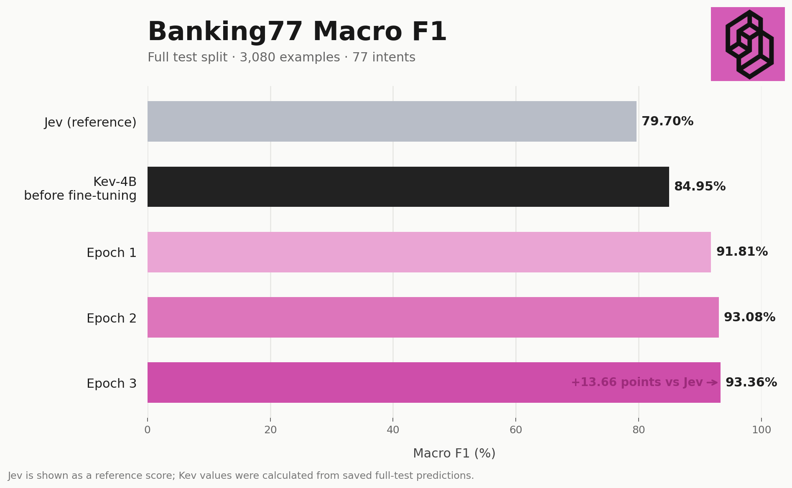

# Kev-4B fine-tuning on Banking77

This project fine-tunes the Kev-4B decision model on Banking77 using LoRA rank 32. It downloads pinned model revisions, saves one checkpoint per epoch, and compares Kev-4B's out-of-the-box performance with every fine-tuned epoch on the full Banking77 test split.

## Achieved results

Training and evaluation use the [Banking77 dataset on Hugging Face](https://huggingface.co/datasets/legacy-datasets/banking77). Each example is classified against all 77 intent labels.

| Item | Value |
|---|---:|
| Training rows | 10,003 |
| Evaluation rows | 3,080 |
| Training epochs | 3 |
| GPU | H100 |
| Training time | 8,502 seconds (2h 21m 42s) |

Macro F1 on the full 3,080-example test split:



Jev's 79.7% is the reference score supplied for comparison. Kev scores are calculated from this experiment's saved test predictions. The TypeSafe AI logo in the chart is from the [official TypeSafe AI profile](https://github.com/typesafe-ai).

Other full-test metrics:

| Checkpoint | Macro F1 | NLL | Median latency | P95 latency |
|---|---:|---:|---:|---:|
| Kev-4B (before fine-tuning) | 84.95% | 0.6527 | 225.8 ms | 236.5 ms |
| Epoch 1 | 91.81% | 0.2816 | 226.9 ms | 237.2 ms |
| Epoch 2 | 93.08% | 0.2652 | 226.9 ms | 237.0 ms |
| Epoch 3 | 93.36% | 0.2810 | 226.6 ms | 236.8 ms |

Here, “Kev-4B (before fine-tuning)” is Kev-4B’s out-of-the-box performance before our Banking77 fine-tuning. Its original rank-16 adapter was expanded to rank 32 without changing its initial predictions so that every checkpoint uses the same LoRA rank. This is not the bare Qwen backbone. Macro F1 and latency are measured over all 3,080 test examples.

## 1. Install

Python 3.12 and a CUDA GPU are recommended.

```bash
cd kev_finetuning
python3.12 -m venv .venv
source .venv/bin/activate
pip install --upgrade pip
pip install -r requirements.txt
```

## 2. Download and prepare the models

```bash
python download_models.py
```

This downloads:

- `Qwen/Qwen3.5-4B-Base` at the pinned revision into `.cache/huggingface/`.
- `jaredpalmer/kev-4b` at the pinned revision into `models/kev-4b-r16/`.

It then prepares `models/kev-4b-r32-init/`, the rank-32 Kev initialization used by fine-tuning. Model downloads and generated checkpoints are excluded from Git.

Use the following command to inspect the planned downloads without downloading anything:

```bash
python download_models.py --dry-run
```

## 3. Configure the experiment

Edit `finetune.yaml` before training. The complete configuration is:

```yaml
paths:
  hf_hub_cache: .cache/huggingface
  train_data: data/train.jsonl
  test_data: data/test.jsonl
  run_output: runs/banking77-full-r32-e3-b16-a2
  epoch_checkpoint_dir: runs/banking77-full-r32-e3-b16-a2/epochs
  benchmark_output: runs/banking77-benchmark
model:
  base: Qwen/Qwen3.5-4B-Base
  base_revision: 1001bb4d826a52d1f399e183466143f4da7b741b
  init_repo: jaredpalmer/kev-4b
  init_revision: 139fdd94f1b6a6ad80cc15e08fcb99cac885a101
  init_from: models/kev-4b-r32-init
  initialization_seed: 42
training:
  method: lora
  epochs: 3
  learning_rate: 2.0e-05
  lora_rank: 32
  batch_size: 16
  gradient_accumulation_steps: 2
  precision: bf16
  weights_precision: fp32
  gradient_checkpointing: true
  device: cuda
  seed: 42
benchmark:
  device: cuda
  rotations: 1
```

The effective training batch size is `batch_size × gradient_accumulation_steps`, which is 32 with this configuration.

## 4. Fine-tune

Inspect the generated trainer command:

```bash
python finetune.py --dry-run
```

Start fine-tuning:

```bash
python finetune.py
```

The final checkpoint is written to:

```text
runs/banking77-full-r32-e3-b16-a2/
```

Individual epoch checkpoints are written to:

```text
runs/banking77-full-r32-e3-b16-a2/epochs/epoch_01/
runs/banking77-full-r32-e3-b16-a2/epochs/epoch_02/
runs/banking77-full-r32-e3-b16-a2/epochs/epoch_03/
```

## 5. Benchmark Kev-4B before fine-tuning and every epoch

After training completes, run:

```bash
python benchmark.py
```

The script evaluates these checkpoints sequentially on all 3,080 Banking77 test examples:

1. Kev-4B out of the box, before our Banking77 fine-tuning (`models/kev-4b-r32-init`).
2. `epoch_01`.
3. `epoch_02`.
4. `epoch_03`.

Results are saved under:

```text
runs/banking77-benchmark/base/
runs/banking77-benchmark/epoch_01/
runs/banking77-benchmark/epoch_02/
runs/banking77-benchmark/epoch_03/
runs/banking77-benchmark/summary.json
```

`summary.json` contains accuracy, negative log-likelihood, median latency, and p95 latency for every checkpoint.

To benchmark only one checkpoint:

```bash
python benchmark.py \
  --checkpoint runs/banking77-full-r32-e3-b16-a2/epochs/epoch_02 \
  --output runs/epoch-02-evaluation
```

Use `python benchmark.py --dry-run` to inspect all benchmark commands without loading a model.

## Data

- `data/train.jsonl`: 10,003 Banking77 training examples.
- `data/test.jsonl`: 3,080 untouched Banking77 test examples.

Each example contains the complete set of 77 Banking77 intent options. Kev-4B lists Banking77 among its original training sources, so this experiment measures fine-tuning adaptation and retention rather than uncontaminated zero-shot generalization.

## Attribution

The minimal Kev modules required for training and benchmarking are included under `vendor/kev/`. Kev is licensed under Apache-2.0; see `vendor/kev/LICENSE` and `vendor/kev/UPSTREAM.md`.
